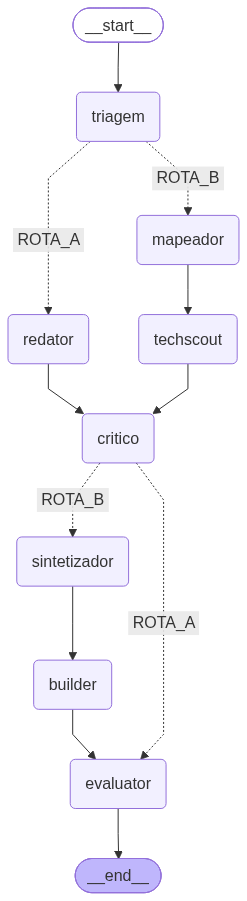

<div align="center">

**🇺🇸 English (this file)** · [🇧🇷 Português do Brasil](README.pt-BR.md)


# RS4-cortex-flow

**Local Multi-Agent Orchestration Engine · Cortex-Flow V2 · v2.0.0**

A deterministic LangGraph pipeline that turns raw human input into scored, auditable deliverables.
Inference and vector storage stay on your machine — **R$ 0,00 per run**.

[](https://www.python.org)
[](https://github.com/langchain-ai/langgraph)
[](https://www.trychroma.com)
[](https://ollama.com)
[](LICENSE)

**Author:** Raphael Mendes · Rs4Machine Lab — 📧 [python.dev.raphael@gmail.com](mailto:python.dev.raphael@gmail.com)

</div>

---

## 📑 Table of Contents

- [1. What problem does this system solve?](#1-what-problem-does-this-system-solve)
- [2. How does it solve it?](#2-how-does-it-solve-it)
- [3. What are the boundaries and performance limits?](#3-what-are-the-boundaries-and-performance-limits)
- [4. Who governs the decision?](#4-who-governs-the-decision)
- [📈 Real-World Benchmarks (E2E Suite)](#-real-world-benchmarks-e2e-suite)
- [🧪 Running the End-to-End Test](#-running-the-end-to-end-test)
- [🚀 Getting Started](#-getting-started)
- [📁 Project Structure](#-project-structure)
- [📄 License](#-license)
- [🏢 Contact](#-contact)

---

## 1. What problem does this system solve?

Turning raw ideas into structured decisions normally requires either hours of manual analysis or sending private material to cloud LLM APIs on a per-token bill.

RS4-cortex-flow addresses the orchestration gap: it chains specialized agents locally to produce **standardized, auditable artifacts** (Markdown with YAML front-matter, code templates, evaluation records) while:

- **Cost stays at R$ 0,00** — no API fees; inference runs on the local machine through Ollama.
- **Data stays local** — prompts, context and the vector store never leave the host during inference and storage (see the egress boundary in [section 3](#3-what-are-the-boundaries-and-performance-limits)).
- **Decisions stay auditable** — every node writes telemetry to `Metrics/`, and every run ends with a written human decision record.

## 2. How does it solve it?

A **LangGraph `StateGraph`** moves a typed **`CortexState`** (`TypedDict`, 17 fields) through specialized nodes, with two **deterministic, LLM-free routers** (rule-based) that select the production route:

| Route | Node sequence | Output |
|---|---|---|
| **A — `COPY_OFFER`** | `triagem → redator → critico → evaluator` | Commercial copy / ad in `drafts/ofertas/` |
| **B — `BUILDER_TEMPLATE`** | `triagem → mapeador → techscout → critico → sintetizador → builder → evaluator` | Refined synthesis + MVP template in `drafts/templates/` |



Supporting layers:

- **Typed state:** `cortex_flow_v2/graph/state.py` defines `CortexState`; the wrapper in `cortex_flow_v2/graph/__init__.py` compiles the graph and exports the diagram above.
- **RAG (ChromaDB):** a persistent local store (`./chroma_db_data`, collection `decisoes`) embedded with `nomic-embed-text` via local Ollama, seeded idempotently from `filosofia_rs4.txt` (`python cortex_flow_v2/vectorstore/seed_dna.py`). Critic, Synthesizer, Builder and Evaluator query it for RS4 decision DNA before prompting.
- **Local inference (Ollama):** REST calls to `localhost:11434` using `qwen2.5:7b` (default), `qwen2.5-coder:7b` (Builder) and `qwen2.5:3b` (fallback), with `temperature=0.2`, `num_predict=1024` and a 240 s HTTP timeout per request.
- **Commerce connector:** `cortex_flow_v2/inbox/conector_commerce.py` loads `PENDENTE` opportunities from `cortex_flow_v2/inbox/payload_commerce.json` into the initial state.

## 3. What are the boundaries and performance limits?

- **Sequential FIFO on CPU:** nodes execute strictly one at a time — no parallel node execution. This is deliberate, to keep RAM/VRAM bounded on consumer hardware.
- **Hardware pause:** `time.sleep(2.0)` runs at every node transition (`PAUSA_HARDWARE_S = 2.0`, Item 09) — 8.0 s total on Route A, 14.0 s on Route B.
- **Model bounds:** 7B-class local models; at most **1,024 tokens** per response (`num_predict`); prompt context capped at **1,500 characters**; **240 s** timeout per request. Nodes degrade gracefully (smaller model or embedded rule fallback) instead of hanging.
- **Wall time:** **481.56 s** for Route A and **2,031.86 s** for Route B on the reference machine (Windows 11 + local Ollama) — about **41.9 minutes** for the full E2E suite, hardware pauses included.
- **Availability gate:** the E2E suite never fabricates results — if Ollama is offline it aborts with `FALHA_OLLAMA_OFFLINE`.
- **Network egress:** inference and vector storage are strictly local. The single optional outbound call is the Tech Scout's DuckDuckGo keyword search, triggered only when RAG returns insufficient hits; it fails soft when offline and is reported in telemetry.
- **Determinism boundary:** triage and routing are pure rules (sub-millisecond, zero LLM calls). LLM text itself is stochastic within the bounds above.

## 4. Who governs the decision?

**Automation Level 1 — HITL (Human in the Loop): the system proposes, the human disposes.**

1. The **Evaluator** grades each deliverable and emits a preliminary score (`NOTA_PRELIMINAR`, 1–5) plus a recommendation:

   | Score | Recommendation |
   |---|---|
   | **Nota ≥ 4** | `APROVAR` (approve) |
   | Nota = 3 | `REVISAR` (revise) |
   | Nota ≤ 2 | `REJEITAR` (reject) |

2. The evaluation is persisted to `drafts/avaliacoes/avaliacao_*.md` with status `AGUARDANDO_DECISAO_HUMANA`.
3. **Final authority is the CEO / Raphael Mendes (Rs4Machine Lab).** The score is advisory only: nothing is approved or published autonomously, and the approval filter is **Nota ≥ 4 plus explicit human confirmation**.

## 📈 Real-World Benchmarks (E2E Suite)

Measured by `Metrics/metrics_integracao_v2.json` during the full E2E run of the Commerce payload (2026-10-03):

| Run | Route | Wall time | Score | Decision | Primary artifacts |
|---|---|---:|---|---|---|
| **A** | `COPY_OFFER` | **481.56 s** | **3 / 5** | **REVISAR** | Drafts in `drafts/ofertas/` |
| **B** | `BUILDER_TEMPLATE` | **2,031.86 s** | **4 / 5** | **APROVAR** | MVP in `drafts/templates/` |
| 0 | Triagem (Agent 0) — deterministic classifier, no LLM | **0.17 ms** | — | — | `frente_alvo` in `CortexState` |

Notes: cumulative wall time of both routes = **2,513.42 s** (hardware pauses included); every run also writes an HITL record to `drafts/avaliacoes/`.

## 🧪 Running the End-to-End Test

```bash
python cortex_flow_v2/tests/test_esteira_completa.py        # both routes (default)
python cortex_flow_v2/tests/test_esteira_completa.py A      # Route A only
python cortex_flow_v2/tests/test_esteira_completa.py B      # Route B only
```

Prerequisites: Ollama online with the models listed below and at least one `PENDENTE` opportunity in `cortex_flow_v2/inbox/payload_commerce.json`.

The suite validates: `py_compile` integrity; orchestrator locks (`num_predict=1024`, `timeout=240s`); Commerce payload load; Ollama health; real execution of each route via `app.invoke(...)`; node sequence via the per-node `Metrics/*.json`; deliverables (copy / synthesis / code / evaluation / score 1–5); and the consolidated report in `Metrics/metrics_integracao_v2.json`.

## 🚀 Getting Started

### 1. Prerequisites

- Python **3.11+** (validated on 3.14)
- [Ollama](https://ollama.com/) running locally with:

  ```bash
  ollama pull qwen2.5:7b
  ollama pull qwen2.5-coder:7b
  ollama pull qwen2.5:3b        # fallback
  ollama pull nomic-embed-text  # RAG embeddings
  ```

- Python dependencies for V2 (the legacy orchestrator is stdlib-only):

  ```bash
  pip install langgraph chromadb ollama
  pip install duckduckgo-search   # optional: Tech Scout web fallback
  ```

### 2. Seed the RAG vector store

```bash
python cortex_flow_v2/vectorstore/seed_dna.py
```

### 3. Run the pipeline

```bash
# Full E2E suite (both routes)
python cortex_flow_v2/tests/test_esteira_completa.py

# Regenerate the graph diagram
python -m cortex_flow_v2.graph
```

### 4. Legacy orchestrator (v1, standard library only)

```bash
python orquestrador_claudio.py teste_frontend.txt
```

### 5. Docker (legacy orchestrator)

```bash
docker compose run --rm claudio-project python orquestrador_claudio.py teste_frontend.txt
```

The Compose stack isolates the orchestrator in a container while reaching the host's Ollama through `host.docker.internal`; `./bruto`, `./agentes`, `./biblioteca` and `./Metrics` are bind-mounted.

**Telemetry:** every node writes `Metrics/metrics_*_v2.json` (system / model / agent dimensions — CEO RS4 rule) with latency, token usage and exit status.

## 📁 Project Structure

```
RS4-cortex-flow/
├── cortex_flow_v2/
│   ├── graph/          # StateGraph, CortexState, routers, hardware pauses
│   ├── nodes/          # triagem, redator, mapeador, techscout, critico, ...
│   ├── inbox/          # Commerce connector + payload_commerce.json
│   ├── vectorstore/    # ChromaDB client + seed_dna (RAG)
│   └── tests/          # unit tests + E2E suite
├── agentes/            # agent prompt files (pt-BR)
├── assets/             # Rs4Machine.png + cortex_flow_v2_graph.png
├── bruto/              # raw inputs (samples only are versioned)
├── drafts/             # outputs: ofertas/, templates/, refinados/, avaliacoes/ (git-ignored)
├── Metrics/            # per-node telemetry (git-ignored)
├── chroma_db_data/     # local vector store (git-ignored)
├── orquestrador_claudio.py   # legacy v1 orchestrator (stdlib only)
├── docker-compose.yml / Dockerfile
└── README.pt-BR.md     # versão em português
```

## 📄 License

This project is open-source software licensed under the MIT License — see the [LICENSE](LICENSE) file for details.

## 🏢 Contact

**Rs4Machine — AI Research Lab & Autonomous Systems**

- **Author:** Raphael Mendes / Rs4Machine Lab
- 📧 **Technical e-mail:** [python.dev.raphael@gmail.com](mailto:python.dev.raphael@gmail.com)
- 🔗 GitHub: [github.com/raphaelmendes-dev](https://github.com/raphaelmendes-dev)

RS4-cortex-flow v2.0.0 — October 2026


